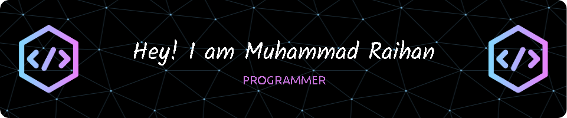

[](https://git.io/typing-svg)

[](https://git.io/typing-svg)

<div id="header" align="center">
  <br>
  
</div>

[](https://www.facebook.com/profile.php?id=100049899516284&locale=id_ID) [](https://www.instagram.com/arimarshello_reall.qwerty_/) 

---

### :woman_technologist: About Me :

- Hi👋, I’m @Dikrey/Muhammad Raihan

- 👨‍💻 A passionate Programmer with endless enthusiasm for technology.

- 🌱 Currently learning at SMKN 1 PST while continuously exploring the world of coding.

- 🚀 My vision: To become a Fullstack Developer capable of creating digital solutions with global impact.

- 💡 My dream is not just to be a developer, but also an innovator who turns challenges into opportunities.

- 🤝 I’m open to collaborating with anyone eager to create innovative projects and make a positive impact.

- 🌟 My skills: Proficient in Frontend Development with a touch of creativity, and skilled in Backend Development to build strong and reliable systems.

- 😄 Pronouns: He/Him

- ⚡ Fun fact: I can spend hours coding but still lose track of time when playing my favorite games!

> 💬 If you have big ideas or exciting projects, let’s discuss and bring them to life together!


```go
package main

import "fmt"

type Biodata struct {
    Nama, Alamat, Email, Telepon string
    Umur                         int
    Pendidikan, Pengalaman       []string
}

func main() {
    bio := Biodata{
        Nama:    "Muhammad Raihan",
        Umur:    16,
        Alamat:  "Jalan Indonesia",
        Email:   "secret@gmail.com",
        Telepon: " - ",
        Pendidikan: []string{
            "MTsN 1 MDN",
            "SMKN 1 PST",
        },
        Pengalaman: []string{
            "Programmer",
            "Student",
        },
    }

    fmt.Println("Biodata:")
    fmt.Println("Nama:", bio.Nama)
    fmt.Println("Umur:", bio.Umur)
    fmt.Println("Alamat:", bio.Alamat)
    fmt.Println("Email:", bio.Email)
    fmt.Println("Telepon:", bio.Telepon)
    fmt.Println("Pendidikan:", bio.Pendidikan)
    fmt.Println("Pengalaman:", bio.Pengalaman)
}
```


# 📊 GitHub Stats:


<br/>
<br/>
  <br/>

### 🔝 Top Contributed Repo


# Overflow Stats
[](https://github.com/kurt-liao/so-stats)

## My Rewards
[](https://github.com/ryo-ma/github-profile-trophy)
<h1>Programming languages:</h1>
<hr>

   
   
  
  
  


  
  
  
  
  

  
<hr>

# Frameworks


# IDEs/Editors


# Music🎧


<hr>
<h1>Office</h1>
<p>
  
  
  
  
  
</p>
<hr>
<h1>Operating System</h1>
<hr>
<p>
    
    
    
    
</p>

##
 <em><b>I genuinely enjoy connecting with new people</b> so if you'd like to say <b>hi, I'd be delighted to get to know you better!</b> :)</em>
> @Raihan_official0307
